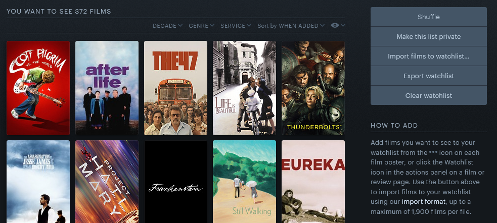
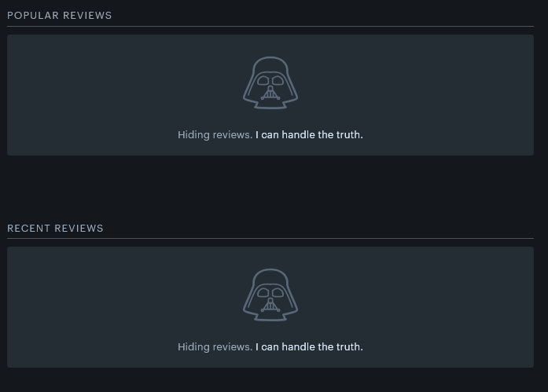
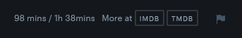

# 🎬 Letterboxd Enhancer

A lightweight browser extension that enhances the [Letterboxd](https://letterboxd.com) experience with practical and optional features.

> ⚠️ **Disclaimer**: This is my first browser extension. It's built out of personal interest and may evolve with time. Feedback and contributions are welcome!

---

## ✨ Features

- 🔄 **Shuffle Button**  
  Adds a shuffle button to *list* and *watchlist* pages for randomized exploration.

- 🎭 **Hide Ratings and Reviews**  
  Hides ratings and reviews by default to avoid bias or spoilers. You can reveal them by clicking “I can handle the truth.”

- ⏱️ **Display Total Runtime**  
  Enhances each movie's runtime (e.g., `89 mins`) by showing a clearer format like `89 mins / 1h 29 mins`.

- ⚙️ **Toggle Options**  
  All features can be enabled or disabled from the extension popup.

---

## 🖥️ Screenshots

### 🔄 Shuffle Button

### 🎭 Spoiler Protection for Reviews

### ⏱️ Runtime Format Enhancement

---